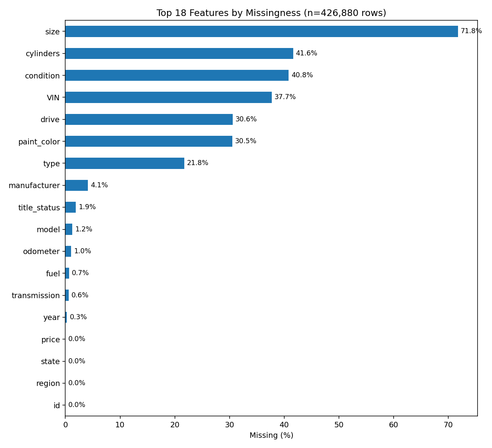
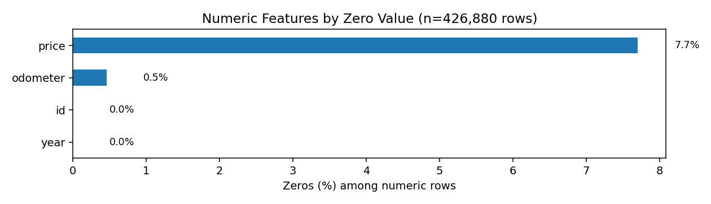
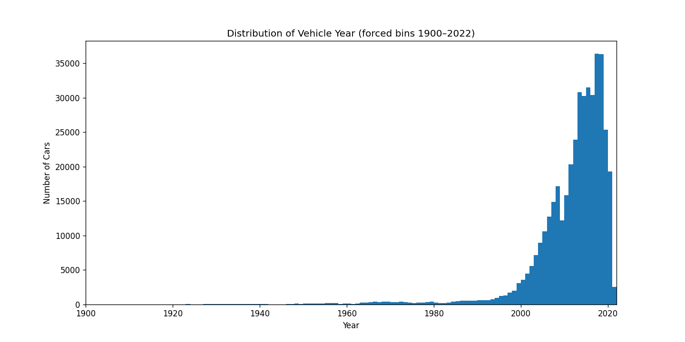

# CarPrice
Assignment 11.1 What Drives the Price of a Car

# Overview
This project explores a used car dataset: [vehicles.csv](data/vehicles.csv) of 426,000 used cars (sampled from the original Kaggle dataset of 3 million entries) with the goal of identifying the key factors that influence used car prices. The analysis follows the CRISP-DM (Cross Industry Standard Process for Data Mining) methodology to ensure a structured and repeatable approach. 

   
  <em>Figure 1: CRISP-DM framework.  Source: UC Berkeley</em>

The final deliverable provides actionable insights and recommendations to a client—a used car dealership—on what consumers value most when purchasing a used car.

Here is [the link of the Jupyter Notebook: Car_Price.ipynb](Car_Price.ipynb) with visualizations and probability distributions. It is developed under Google's Colab.

# Methodology (CRISP-DM Framework)

## 1. Business Understanding  
   - **Objective:**  
     - Identify what makes cars more or less expensive.  
     - Translate business problem into analytical questions  
       (e.g., “How do mileage, age, and brand affect price?”)

## 2. Data Understanding

The raw dataset contains **426,000 rows × 18 columns**, meaning it has 426,000 records with 18 features.  
The features include:  

`id`, `region`, `price`, `year`, `manufacturer`, `model`, `condition`, `cylinders`, `fuel`, `odometer`,  
`title_state`, `transmission`, `VIN`, `drive`, `type`, `size`, `paint_color`, and `state`.  

Among them, three are **numeric features**, and the rest are **categorical features**.  

The dataset has several issues such as missing values, extreme numbers, unusually wide ranges, and fabricated-looking records.  
Below is my initial understanding of the data:

a. **Missing values** – Many features contain missing data. A summary graph shows the percentages of missing values for each feature.  

   
  <em>Figure: Top 18 features with missing values</em>

b. **Zero values in numeric features** – Some numeric features contain a large number of zeros. A summary graph highlights this issue.  

   
  <em>Figure: Numeric features with missing values</em>

c. **Car age range** – The dataset includes vehicles ranging from brand new to over 120 years old. Extremely old cars are unrealistic and do not reflect true market prices.  

   
  <em>Figure: Vehicle Age Distribution</em>

d. **Odometer values** – While many cars have reasonable mileage (up to 500K), some records report **1M to even 10M miles**, which are clearly unrealistic.  

e. **Extreme prices** – Over 7% of cars are listed as *free*. On the other hand, some records show extreme prices of **$1M, $10M, or even $100M**, which are almost certainly fabricated.  

f. **Irrelevant features** – Some features, such as `id` and `VIN`, do not provide meaningful information for predicting car prices. 

g. **Severely missing features** – The `size` feature has over **70% missing values**, making it practically unusable.  

h. **Non-standardized text** – Car model names are highly descriptive and inconsistent, making it difficult to reliably identify unique models.  

i. **Redundancy** – Certain features disclose overlapping information (e.g., `region` and `state`), leading to redundancy in the dataset.  

## 3. Data Preparation

In order to make the dataset useful for modeling, several **data cleaning and transformation steps** were performed, including imputation, feature/record removal, and capping of unrealistic values.

### Data Cleaning
- **Feature removal**:  
  - Dropped `id` and `VIN` because they are unrelated to price.  
  - Dropped `size` due to excessive missing values (>70%).  
  - Dropped `model` because the descriptions were inconsistent and not standardized.  

- **Outlier capping**:  
  - Applied caps to extreme values for key numeric features:  
    - **Price**: limited to \$3,000 – \$100,000  
    - **Age**: maximum of 30 years  
    - **Odometer**: maximum of 300,000 miles  

- **Missing value imputation**:  
  - **Categorical features** → imputed with **mode**  
  - **Numeric features** → imputed with **median**  

### Feature Encoding
To improve correlation between categorical features and car price:  
- Instead of One-Hot Encoding (which produces very sparse features), we applied:  
  - **James–Stein Encoding** for high-cardinality categorical features such as `manufacturer`, `state`, and `paint_color`.  
  - **Ordinal encoding** for features with natural order (e.g., `cylinders`, `type`).  

### Feature Selection
Sequential Feature Selection (SFS) was used to identify the most important predictors.  
The top predictors and their corresponding cross-validation performance (negative MSE) are:  

### Selected Features from SFS

| Feature       | CV neg-MSE   |
|---------------|--------------|
| Year          | −0.296639    |
| Cylinders     | −0.233038    |
| Odometer      | −0.204125    |
| Drive         | −0.178581    |
| Fuel type     | −0.159953    |
| Manufacturer  | −0.150940    |

## 4. Modeling

At this stage, the dataset was split into **Training (80%)** and **Test (20%)** sets.  
The test set remained **untouched until the final evaluation** to ensure unbiased performance measurement.  

To maintain a clean, consistent, and leak-free workflow, we built a **Pipeline** that chained multiple steps (imputation, scaling, and regression) into one object.  

Model selection was performed using **5-fold Cross Validation (CV)** with **GridSearchCV** on the training set.  
The following regression models and hyperparameter grids were evaluated:

---

### Regression Models and Hyperparameter Grids Used in Cross Validation

| Regression Model | Grid Parameters Tested                                                                 |
|------------------|----------------------------------------------------------------------------------------|
| Linear Regression | None                                                                                  |
| Ridge            | `alpha`: (0.001, 0.01, 0.1, 1, 10, 100)                                               |
| Lasso            | `alpha`: (0.0001, 0.001, 0.01, 0.1, 1)                                                |
| ElasticNet       | `alpha`: (0.0001, 0.001, 0.01, 0.1)   `l1_ratio`: (0.1, 0.5, 0.9)                   |
| Huber Regressor  | `epsilon`: (1.2, 1.5, 1.8, 2.5)   `alpha`: (0.000001, 0.00001, 0.0001, 0.001)       |

---

### Best Hyperparameters Found (after Cross Validation)

| Regression Model|  Best Params                       |
|-----------------|------------------------------------|
| Lasso           | `alpha = 0.0001`                   |
| ElasticNet      | `alpha = 0.0001`, `l1_ratio = 0.1` |
| Ridge           | `alpha = 10`                       |
| OLS (Linear)    | None                               |
| Huber           | `alpha = 0.001`, `epsilon = 2.5`   |

---

### Final Model Evaluation (on Test Dataset)

After refitting each model using the **entire training dataset (80%)**, we evaluated them on the untouched **test dataset (20%)**.  
The performance metrics are summarized below:

| Regression Model | Best Params                                | Selected Features                  | RMSE ($) | MAE ($) | R² (log) | R² ($) | RMSE trim2% ($) | MAE trim2% ($) |
|------------------|--------------------------------------------|------------------------------------|----------|---------|----------|--------|-----------------|----------------|
| **Huber**        | `{alpha: 0.001, epsilon: 2.5}`             | year, cylinders_num, js_type, odometer… | 8823.15  | 5837.66 | 0.6942   | 0.6217 | 7389.41         | 5367.41        |
| **Lasso**        | `{alpha: 0.0001}`                          | year, cylinders_num, js_type, odometer… | 8831.18  | 5837.01 | 0.6945   | 0.6210 | 7386.25         | 5363.88        |
| **ElasticNet**   | `{alpha: 0.0001, l1_ratio: 0.1}`           | year, cylinders_num, js_type, odometer… | 8832.49  | 5837.64 | 0.6945   | 0.6209 | 7387.39         | 5364.42        |
| **Ridge**        | `{alpha: 10}`                              | year, cylinders_num, js_type, odometer… | 8832.86  | 5837.82 | 0.6945   | 0.6208 | 7387.72         | 5364.58        |
| **OLS**          | `{}`                                       | year, cylinders_num, js_type, odometer… | 8832.98  | 5837.88 | 0.6945   | 0.6208 | 7387.84         | 5364.63        |

---
# 6. Evaluation

The major evaluation was conducted on the **final 20% untouched test set**.  
The resulting metrics are summarized in the table above.

---

### Interpreting the Metrics
- **R² ($) = 0.62**  
  The model explains about **62% of the variance** in car prices (in dollar space).  
  For messy, real-world used-car data, this represents a respectable level of performance.  

- **RMSE ≈ $8.8K / MAE ≈ $5.8K**  
  On average, individual predictions are off by around **$6K**, with larger misses raising the RMSE.  
  After trimming the most extreme 4% of records (2% high, 2% low), the errors improve to **$7.4K (RMSE) / $5.36K (MAE)** — indicating that most cars are predicted within **$5K–6K**.  

---

### Model Comparison
All five regression models performed nearly identically — differences in error metrics were minimal.  
This suggests that the **predictive power is primarily driven by the features themselves**, rather than the specific choice of linear regularization method.  

---

### Sources of Error
Why can errors still appear large?  
- **Extreme vehicles / outliers** heavily influence residuals.  
- **Categorical sparsity** (rare categories with limited examples) reduces predictive precision.  

---

### Overall Assessment
Is this a *“good”* model?  
✅ **Yes.** While not perfect, the model achieves a strong balance between interpretability and accuracy.  
Given the noisy, imperfect nature of real-world used-car data, the performance is both reasonable and reliable.  

# 6. Deployment

For deployment, the project used **Sequential Feature Selection (SFS)** to identify the six most important predictors (lowest CV MSE):  
**Year, Cylinders, Odometer, Drive, Fuel type, and Manufacturer.**

After evaluation, the predicted prices were reasonably solid, and the findings align well with real-world expectations. These features can be interpreted as **key price drivers for used cars**:

1. **Mileage (Odometer)** – Price decreases with every additional 10K miles.  
2. **Age (Year)** – Price decreases with each additional year of age.  
3. **Cylinders** – More cylinders generally indicate better performance and capability, which supports higher prices.  
4. **Drive (e.g., 4WD)** – Four-wheel drive is often considered a premium feature, associated with safety and stability.  
5. **Manufacturer (Brand)** – Well-regarded brands (reliability, reputation) tend to retain higher value.  
6. **Fuel Type (Diesel)** – Diesel vehicles (especially trucks/pickups) are often priced higher due to utility and durability.  

---

✅ **Recommendation:**  
Car dealerships and resellers should treat these six features as the **primary price drivers** when evaluating or pricing used vehicles.

# 6. Deployment
On the project, we used Sequential Features Selection to select 6 lowest MSE features. They are Year, Cylinders, Odometer, Drive, Fuel type, and Manufacturer.  After evaluation, the predict price is also pretty solid.  It thus can interpret as price driver for a used ca. The find out also reflect in reality.  
a. Lower mileage 
   price will decrease for every 10K mileage added.
b. Newer age
   price will decrease per year.
c. More Cylinders
   more cyclinders represent the better performance and capability.
d. 4WD drive
   it is a kind of premium.  It represent more safe and more stable.
e. good Brand
   good means reliable
f. diesel  
   diesel mostly used on truck/pickup/, it is usually pricer.

So we highly recommend car dealership treat these 6 features as a price driver for a used car

The meanining of the metrics:
R²($) = 0.62.  It means the model explains ~62% of price variance in dollar spce.  For messy, real-world used-dar dta, that's respectable.
RMSE = ~$8.8k / MAE = ~5.8k.  Typical single-car errors around $6k, with larger misses pulling RMSE up.  After 4 percents trimming(2%high, 2%low), errors drop to $7.4k/$5.36k,  so most cars are predicted within ~5-6K.
What the table telling us
All five regression model are basically ties.  Differences are tiny.  That implies feature signal ,not the specific linear penalty, is the main limiter.
Then why error can sometimes still feel large? It comes from the extreme vehicles.  It behave like outliers affect the prediction.  And also Categroical sparsity is also a concern.
So is it a "good" model.  The answer is yes though not perfect.
