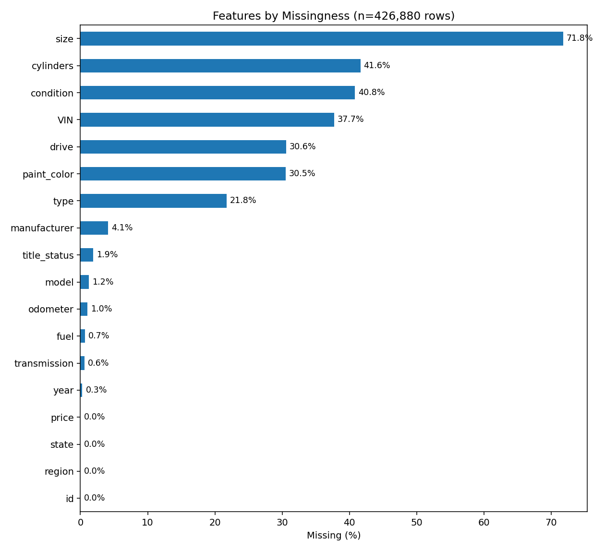

# CarPrice
Assignment 11.1 What Drives the Price of a Car

# Overview
This project explores a used car dataset: [vehicles.csv](data/vehicles.csv) of 426,000 used cars (sampled from the original Kaggle dataset of 3 million entries) with the goal of identifying the key factors that influence used car prices. The analysis follows the CRISP-DM (Cross Industry Standard Process for Data Mining) methodology to ensure a structured and repeatable approach. 

   
  <em>Figure 1: CRISP-DM framework.  Source: UC Berkeley</em>

The final deliverable provides actionable insights and recommendations to a client—a used car dealership—on what consumers value most when purchasing a used car.

Here is [the link of the Jupyter Notebook: Car_Price.ipynb](Car_Price.ipynb) with visualizations and probability distributions. It is developed under Google's Colab.

# Methodology (CRISP-DM Framework)

## 1. Business Understanding  
   - **Objective:**  
     - Identify what makes cars more or less expensive.  
     - Translate business problem into analytical questions  
       (e.g., “How do mileage, age, and brand affect price?”)

## 2. Data Understanding

The raw dataset contains **426,000 rows × 18 columns**, meaning it has 426,000 records with 18 features.  
The features include:  

`id`, `region`, `price`, `year`, `manufacturer`, `model`, `condition`, `cylinders`, `fuel`, `odometer`,  
`title_state`, `transmission`, `VIN`, `drive`, `type`, `size`, `paint_color`, and `state`.  

Among them, three are **numeric features**, and the rest are **categorical features**.  

The dataset has several issues such as missing values, extreme numbers, unusually wide ranges, and fabricated-looking records.  
Below is my initial understanding of the data:

a. **Missing values** – Many features contain missing data. A summary graph shows the percentages of missing values for each feature.  

   
  <em>Figure: Top 18 features with missing values</em>

b. **Zero values in numeric features** – Some numeric features contain a large number of zeros. A summary graph highlights this issue.  

   
  <em>Figure: Numeric features with missing values</em>

c. **Car age range** – The dataset includes vehicles ranging from brand new to over 120 years old. Extremely old cars are unrealistic and do not reflect true market prices.  

   
  <em>Figure: Vehicle Age Distribution</em>

d. **Odometer values** – While many cars have reasonable mileage (up to 500K), some records report **1M to even 10M miles**, which are clearly unrealistic.  

e. **Extreme prices** – Over 7% of cars are listed as *free*. On the other hand, some records show extreme prices of **$1M, $10M, or even $100M**, which are almost certainly fabricated.  

f. **Irrelevant features** – Some features, such as `id` and `VIN`, do not provide meaningful information for predicting car prices. 

g. **Severely missing features** – The `size` feature has over **70% missing values**, making it practically unusable.  

h. **Non-standardized text** – Car model names are highly descriptive and inconsistent, making it difficult to reliably identify unique models.  

i. **Redundancy** – Certain features disclose overlapping information (e.g., `region` and `state`), leading to redundancy in the dataset.  

## 3. Data Preparation

In order to make the dataset useful for modeling, several **data cleaning and transformation steps** were performed, including imputation, feature/record removal, and capping of unrealistic values.

### Data Cleaning
- **Feature removal**:  
  - Dropped `id` and `VIN` because they are unrelated to price.  
  - Dropped `size` due to excessive missing values (>70%).  
  - Dropped `model` because the descriptions were inconsistent and not standardized.  

- **Outlier capping**:  
  - Applied caps to extreme values for key numeric features:  
    - **Price**: limited to \$3,000 – \$100,000  
    - **Age**: maximum of 30 years  
    - **Odometer**: maximum of 300,000 miles  

- **Missing value imputation**:  
  - **Categorical features** → imputed with **mode**  
  - **Numeric features** → imputed with **median**  

### Feature Encoding
To improve correlation between categorical features and car price:  
- Instead of One-Hot Encoding (which produces very sparse features), we applied:  
  - **James–Stein Encoding** for high-cardinality categorical features such as `manufacturer`, `state`, and `paint_color`.  
  - **Ordinal encoding** for features with natural order (e.g., `cylinders`, `type`).  

### Feature Selection
Sequential Feature Selection (SFS) was used to identify the most important predictors.  
The top predictors and their corresponding cross-validation performance (negative MSE) are:  

### Selected Features from SFS

| Feature       | CV neg-MSE   |
|---------------|--------------|
| Year          | −0.296639    |
| Cylinders     | −0.233038    |
| Odometer      | −0.204125    |
| Drive         | −0.178581    |
| Fuel type     | −0.159953    |
| Manufacturer  | −0.150940    |

## 4. Modeling

At this stage, the dataset was split into **Training (80%)** and **Test (20%)** sets.  
The test set remained **untouched until the final evaluation** to ensure unbiased performance measurement.  

To maintain a clean, consistent, and leak-free workflow, we built a **Pipeline** that chained multiple steps (imputation, scaling, and regression) into one object.  

Model selection was performed using **5-fold Cross Validation (CV)** with **GridSearchCV** on the training set.  
The following regression models and hyperparameter grids were evaluated:

---

### Regression Models and Hyperparameter Grids

| Regression Model | Grid Parameters Tested                                                                 |
|------------------|----------------------------------------------------------------------------------------|
| Linear Regression | None                                                                                  |
| Ridge            | `alpha`: (0.001, 0.01, 0.1, 1, 10, 100)                                               |
| Lasso            | `alpha`: (0.0001, 0.001, 0.01, 0.1, 1)                                                |
| ElasticNet       | `alpha`: (0.0001, 0.001, 0.01, 0.1)   `l1_ratio`: (0.1, 0.5, 0.9)                   |
| Huber Regressor  | `epsilon`: (1.2, 1.5, 1.8, 2.5)   `alpha`: (0.000001, 0.00001, 0.0001, 0.001)       |

---

### Best Hyperparameters Found (after Cross Validation)

| Model        | Best Params                       |
|--------------|-----------------------------------|
| Lasso        | `alpha = 0.0001`                  |
| ElasticNet   | `alpha = 0.0001`, `l1_ratio = 0.1`|
| Ridge        | `alpha = 10`                      |
| OLS (Linear) | None                              |
| Huber        | `alpha = 0.001`, `epsilon = 2.5`  |

---

### Final Model Evaluation (on Test Dataset)

After refitting each model using the **entire training dataset (80%)**, we evaluated them on the untouched **test dataset (20%)**.  
The performance metrics are summarized below:

| Model       | Best Params                                | Selected Features                  | RMSE ($) | MAE ($) | R² (log) | R² ($) | RMSE trim2% ($) | MAE trim2% ($) |
|-------------|--------------------------------------------|------------------------------------|----------|---------|----------|--------|-----------------|----------------|
| **Huber**   | `{alpha: 0.001, epsilon: 2.5}`             | year, cylinders_num, js_type, odometer… | 8823.15  | 5837.66 | 0.6942   | 0.6217 | 7389.41         | 5367.41        |
| **Lasso**   | `{alpha: 0.0001}`                          | year, cylinders_num, js_type, odometer… | 8831.18  | 5837.01 | 0.6945   | 0.6210 | 7386.25         | 5363.88        |
| **ElasticNet** | `{alpha: 0.0001, l1_ratio: 0.1}`        | year, cylinders_num, js_type, odometer… | 8832.49  | 5837.64 | 0.6945   | 0.6209 | 7387.39         | 5364.42        |
| **Ridge**   | `{alpha: 10}`                              | year, cylinders_num, js_type, odometer… | 8832.86  | 5837.82 | 0.6945   | 0.6208 | 7387.72         | 5364.58        |
| **OLS**     | `{}`                                       | year, cylinders_num, js_type, odometer… | 8832.98  | 5837.88 | 0.6945   | 0.6208 | 7387.84         | 5364.63        |

---

##4.  Modeling
In the Modeling section, we make a hold-out split which split the full clean dataset into Train Dataset and Test Dataset.  The ratio is 80/20.  The Training Dataset is 80% and the Test Dataset is 20%.  The Test Dataset will set stays untouched until the very end.
In order to have a training and testing flow clean, conasistent and leak-safe, we biuld a Pipeline container to chains multiple steps (like imputation, scaling and regression) into one object. 
We then run 5-fold Cross Validation(CV) with GridSearchCV using the Training Dataset. The following is the name of the Regression  and their GridSet that used on the CV.

			Name of Regression			GridSet Used:
			LinearRegression : 			No
			Ridge:                      GridSet for alpha:   (0.001, 0.01, 0.1, 1, 10, 100)
			Lasso:                      GridSet for alpha:   ( 0.0001, 0.001, 0.01, 0.1, 1)
			ElasticNet:                 GridSet for alpha:   (0.0001, 0.001,0.01,0.1, )
                                        GridSet for Ratio:   (0.1, 0.5, 0.9)
			HuberRegressor              GridSet for epsilon: (1.2,1.5,1.8,2.5) 
                                        GridSet for alpha:   (0.000001, 0.00001, 0.0001,0.001)
										
we got the best superparameter as follows:

			Lasso:		  alpha:	0.0001
			EleasticNet	  alpha:    0.0001
					      Ratio:    0.1
			Rdige:		  alpha:	10
			OLS		      No
			Huber		  alpha:    0.001
					      Epsilon   2.5
		   
Refit the model using the entire Training Dataset (all 80%), we got the best model.  With the best model, we thus get the prediction/evaluation with the final untouch Test DataSet.  The following is the metrics we got from the Final Test:

Model	Best Params	Selected 6	RMSE($)	MAE($)	R²_log	R²($)	RMSE_trim2%($)	MAE_trim2%($)
0	Huber	{'reg__alpha': 0.001, 'reg__epsilon': 2.5}	year, cylinders_num, js_type, odometer_10k, js...	8823.150950	5837.659077	0.694194	0.621666	7389.407433	5367.409313
1	Lasso	{'reg__alpha': 0.0001}	year, cylinders_num, js_type, odometer_10k, js...	8831.175428	5837.008993	0.694464	0.620977	7386.253225	5363.875280
2	ElasticNet	{'reg__alpha': 0.0001, 'reg__l1_ratio': 0.1}	year, cylinders_num, js_type, odometer_10k, js...	8832.491834	5837.637211	0.694465	0.620864	7387.389028	5364.415106
3	Ridge	{'reg__alpha': 10}	year, cylinders_num, js_type, odometer_10k, js...	8832.863577	5837.820147	0.694466	0.620832	7387.724159	5364.576595
4	OLS	{}	year, cylinders_num, js_type, odometer_10k, js...	8832.984490	5837.880880	0.694466	0.620822	7387.836299	5364.631111

